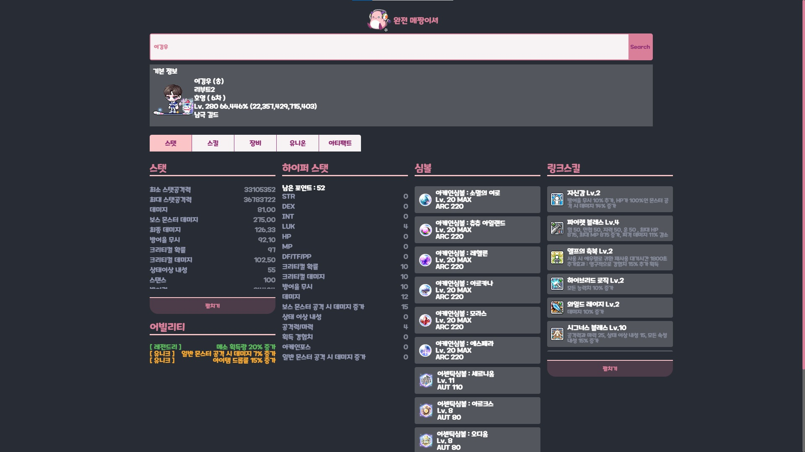
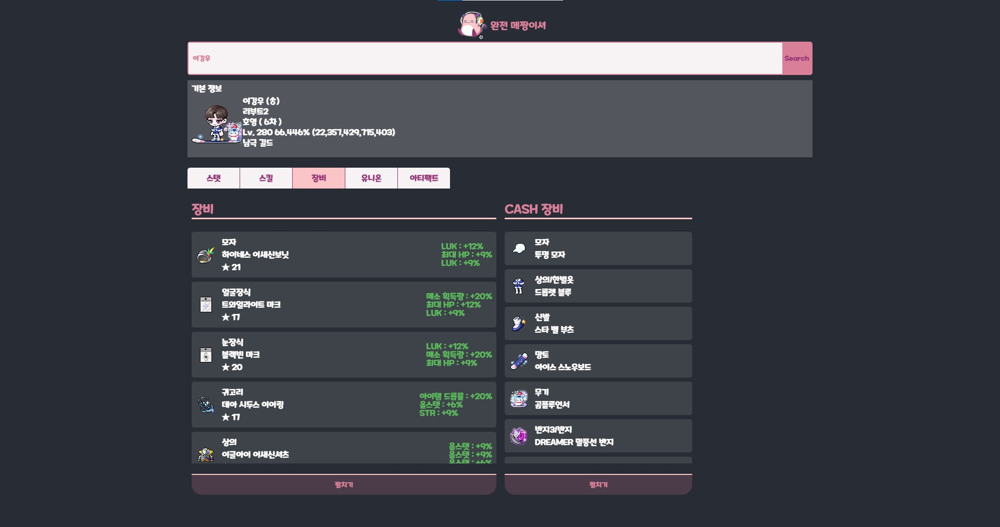

# MapleJJANG
Nexon Open API를 이용한 메이플스토리 **캐릭터 정보 조회 서비스** 입니다.

완전 메짱이셔

 

## 🚩 기획 배경

---

가끔씩 이벤트때마다 즐기던 메이플스토리에서 항상 새로운 캐릭터를 키울때 해당 직업의 스킬트리, 스탯정보등을 검색해서 찾아 보았습니다.

이번에 Nexon Open API가 추가된다는 소식을 듣고, 내가 키우려는 직업의 1~50위까지 랭킹정보를 가져와 캐릭터정보를 조회하여, 스탯정보나 스킬트리를 참고할 수 있도록 만들어 보았습니다.

 

## 🤼‍♂️ 개요

---

- 프로젝트 이름 : MapleJJANG
- 기술 Stack : React, Typescript, Node.js

 

## 🎯 목표

---

* 생각한 기능 구현
  * 직업랭킹, 스탯, 스킬(하이퍼스탯, 5차, 6차 관련, 유니온) 조회
  * 내용이 많을 시 (접기, 펼치기로 높이조절 )
  * 유니온 테이블 그려보기

 

## 👀 MapleJJANG(메짱)의 분야별 기능 소개

---

### 👉 메인 화면

| MAIN                                      |
| ----------------------------------------- |
|              |
| ● 선택한 직업의 50위까지 랭킹정보를 조회. |

 

### 👉 스탯 정보

| Stat                                                         |
| ------------------------------------------------------------ |
|                                    |
| ● 입력한 닉네임의 기본정보를 가져와 search bar 하단에 배치. ● `스탯`, `어빌리티 능력치`, `하이퍼 스탯`, `심볼`, 사용 중인 `링크 스킬`의 정보를 보여준다. ● 심볼의 경우 사용중인 심볼의 레벨과 포스 수치를 볼 수 있다. ● 링크 스킬의 경우 스킬의 이름과 레벨, 효과를 볼 수 있다.  (같은 직업군의 경우 레벨이 2이상이기 때문에 레벨도 표시하였다.) |

 

### 👉 스킬 정보

| Skill                                                        |
| ------------------------------------------------------------ |
|                                   |
| ● 해당 캐릭터의 `하이퍼 패시브 스킬`, `5차 스킬`, `6차 스킬`, `6차 Hexa 스탯`정보를 보여준다. ● 하이퍼 액티브스킬의 경우 모든 종류를 다 찍기 때문에 제외 ● 스킬의 `이름`, `레벨`, `스킬 효과`을 확인할 수 있다. |

 

### 👉 장비 정보

| Equipment                                                    |
| ------------------------------------------------------------ |
|                               |
| ● 해당 캐릭터의 장착 중인 장비정보와 캐시 아이템 정보를 확인. ● 장비 정보에서는 `장착 부위`, `스타포스`, `잠재 옵션`을 알 수 있다.  (추후 추가) ● 캐시 장비의 경우 preset이 3번까지 정보가 넘어오는데, preset_no로 지정된 preset의 정보를 보여준다. |

 

### 👉 유니온 정보

| Union                                                        |
| ------------------------------------------------------------ |
|                                   |
| ● 해당 캐릭터의 유니온 정보를 확인. ● 유니온 공격대 정보에 담긴 좌표값들을 토대로 `유니온 테이블`을 그림. ● 그 외에 `공격대 점령효과`, `유니온 Memeber`, `공격대원 효과`를 확인할 수 있다. |

